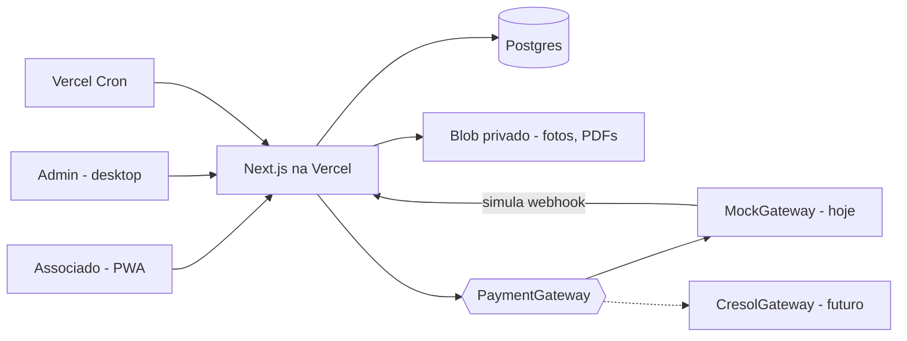

# COOIMEL App — Arquitetura (v1)

> Base: mockups `43865327-...jpg` (15 telas do associado) e logo oficial `4204812c-...jpg`.
> Atualizado: 2026-10-06.

## 0. Decisões tomadas

| Tema | Decisão |
|---|---|
| Banco | **Cresol** no futuro. Por ora: **gateway mock** (simula boleto, Pix e confirmação de pagamento) atrás de uma interface, trocável depois. |
| Dados | **Cadastro do zero** pelo admin. Sem importação. Cadastro completo, com **foto do associado**. |
| Propriedades | **1 associado : N propriedades.** |
| Multa/juros | **Não definidos.** Ficam **configuráveis no admin** (padrão 0%); o código já suporta. |
| Cotação | **Digitada pelo admin.** |
| Design | **O mais fiel possível ao mockup** (cores, layout, componentes — §3). |
| Admin | Área **somente web/desktop** (responsividade mínima). Cadastra usuários e associados e **define a senha inicial**. |
| Domínio | Por ora, o domínio padrão da **Vercel** (`*.vercel.app`). Domínio próprio depois. |

## 1. Visão geral

Dois "apps" no **mesmo projeto Next.js**:

1. **App do associado** — PWA mobile-first (Telas 1–15). No desktop, renderiza centralizado em coluna de ~430px (aparência de celular).
2. **Admin** — `/admin`, layout desktop com sidebar e tabelas. Acesso só para perfis `admin`/`operador`.



## 2. Stack

| Camada | Escolha |
|---|---|
| Framework | Next.js (App Router) + TypeScript, Server Components + Server Actions |
| UI | Tailwind CSS + shadcn/ui (customizado com os tokens do §3), ícones `lucide-react` |
| Tabelas do admin | TanStack Table (via shadcn data-table) |
| Formulários | react-hook-form + zod (mesmo schema valida no servidor) |
| Banco | PostgreSQL (Neon, via Vercel Marketplace) + Drizzle ORM |
| Auth | Better Auth com plugin de username (CPF) + papéis; sessão em cookie httpOnly |
| Arquivos | Vercel Blob **privado** (foto do associado, PDF de boleto, anexos de avisos) |
| Imagem | Corte/redimensionamento da foto no cliente (react-easy-crop) → WebP ~512px |
| PWA | manifest + service worker (Serwist) |
| Jobs | Vercel Cron (marcar cobranças vencidas) |
| Erros | Sentry |

### Estrutura de pastas

```
app/
  (auth)/login                      Tela 2 (+ Tela 1 como abertura)
  (auth)/trocar-senha               troca obrigatória no 1º acesso
  (associado)/layout.tsx            header verde + bottom nav + menu lateral (Tela 15)
    inicio/                         Tela 3
    pagamentos/                     Tela 4
    pagamentos/[id]/                Tela 5 / Tela 7 (se vencida)
    pagamentos/[id]/boleto/         Telas 6 e 12
    pagamentos/[id]/pix/            Tela 13
    pagamentos/[id]/sucesso/        Tela 14
    historico/                      Tela 11
    cotacao/                        Tela 8 (+ histórico)
    avisos/  avisos/[id]/           Tela 9
    cadastro/                       Tela 10
    configuracoes/                  trocar senha, sair
  admin/(desktop)/layout.tsx        sidebar + topbar
    page.tsx                        dashboard (em aberto, vencidas, arrecadado)
    associados/  novo/  [id]/       CRUD + foto + propriedades + acesso
    cobrancas/   gerar/  [id]/      geração em lote, detalhe, cancelar, baixa manual
    pagamentos/                     lista + conciliação
    avisos/                         CRUD + publicar
    cotacao/                        lançar valor, histórico
    usuarios/                       admins/operadores
    configuracoes/                  tarifa R$/ha, multa %, juros %, dados da coop
    simulador-banco/                (só com gateway mock) marcar boleto/Pix como pago
  api/webhooks/pagamentos/[provider]/route.ts
  api/cron/vencimentos/route.ts
lib/
  domain/      cobranca.ts (valor, encargos, status), situacao.ts — funções puras + testes
  payments/    gateway.ts (interface), mock.ts, cresol.ts (stub)
  db/          schema.ts, queries por módulo
  auth/        config, guards requireAssociado() / requireAdmin()
  format/      moeda, CPF (máscara), datas pt-BR, hectares
components/
  app/         componentes do associado (§3.3)
  admin/
public/brand/  logo oficial (vetorizar), ícones PWA
```

## 3. Design (fiel ao mockup)

### 3.1 Tokens (cores extraídas do mockup)

| Token | Hex | Onde aparece |
|---|---|---|
| `--brand-900` | `#013220` | fundo do login, header de todas as telas |
| `--brand-800` | `#0F3A2A` | header (variação), menu |
| `--brand-700` | `#065E38` | tab ativa (Tela 4), títulos de valor |
| `--brand-600` | `#0A703C` | botões primários ("GERAR BOLETO", "Visualizar boleto") |
| `--brand-500` | `#11833A` | botão "ENTRAR", ícones de check |
| `--brand-50` | `#E9F7F0` | fundo do card "REGULAR", botões outline Pix, linha "Total" |
| `--danger-600` | `#DD2538` | "PAGAR AGORA", banner "PAGAMENTO EM ATRASO", "Em aberto" vencido |
| `--danger-50` | `#FEF4F3` | card "Valor em aberto" |
| `--warning-500` | `#DB912C` | ícone de relógio (a vencer) |
| `--info-500` | `#1E88E5` | gota da taxa de irrigação, ícone dos avisos de orientação |
| `--bg` | `#F7F8F9` | fundo das telas |
| `--surface` | `#FFFFFF` | cards |
| `--text` | `#1F2933` | texto principal |
| `--muted` | `#6B7280` | legendas ("Matrícula", "Vencimento") |

- **Fonte:** Roboto (o mockup tem estilo Android/Material). Pesos 400/500/700.
- **Raio:** cards 12px, botões 8px, chips/tabs 999px (Tela 4) ou 8px (Tela 11).
- **Sombra:** suave (`0 1px 3px rgb(0 0 0 / .08)`).
- **Botões primários:** caixa alta e negrito em algumas telas ("ENTRAR", "GERAR BOLETO", "PAGAR AGORA"); seguir o mockup tela a tela.

### 3.2 Logo

O mockup usa um ícone genérico (gota + folhas). **Decisão pendente:** usar o **logo oficial** (círculo com pinheiros) no splash e no login, e uma versão simplificada no header. Precisamos do logo em **vetor (SVG/PDF)**; a foto atual tem fundo e reflexo.

### 3.3 Componentes do app do associado

| Componente | Telas |
|---|---|
| `AppHeader` (verde, título, voltar, sino com badge, hambúrguer) | todas |
| `BottomNav` (Início · Pagamentos · Boletos · Arroz · Mais) | 3, 4, 9, 10, 11 |
| `SideMenu` (drawer) | 15 |
| `StatCard` (ícone + rótulo + valor) | 3 (áreas) |
| `AlertCard` "Valor em aberto" | 3 |
| `StatusCard` "Situação: REGULAR / EM ATRASO" | 3 |
| `QuickActionGrid` (2×2) | 3 |
| `SegmentedTabs` | 4, 11 |
| `ChargeListItem` (ícone de status, título, data, valor, status) | 4, 11 |
| `ChargeSummary` (gota + competência + vencimento) | 5, 6, 7, 12, 13 |
| `AmountBreakdown` (linhas chave/valor + total destacado) | 5, 7 |
| `Barcode` (Code 128/ITF da linha digitável) | 6 |
| `PixQr` + copiar código | 13 |
| `SuccessState` (check grande + dados) | 12, 14 |
| `NoticeCard` (ícone por tipo, data, resumo, chevron) | 9 |
| `PriceCard` (foto do arroz, valor, data, região, fonte) | 8 |
| `ProfileHeader` (**foto** do associado ou avatar padrão) + `InfoList` | 10 |

**Mudança sobre o mockup:** a Tela 10 mostra só um avatar genérico; como haverá foto, ela aparece no `ProfileHeader` e também no menu lateral/saudação da Tela 3.

## 4. Modelo de dados

Dinheiro em **centavos (integer)**, áreas em `numeric(10,2)`, percentuais em **basis points** (int).

```
usuario            id, cpf (único), nome, email, senha_hash, papel (associado|operador|admin),
                   ativo, deve_trocar_senha (bool), ultimo_login_em, criado_por
associado          id, usuario_id (único), matricula (único), nome, cpf, rg, data_nascimento,
                   telefone, email, foto_blob_key, endereço (logradouro, número, bairro,
                   cidade, uf, cep), situacao_cadastral (ativo|inativo|suspenso),
                   data_admissao, observacoes
propriedade        id, associado_id, nome, matricula_imovel/CAR (opcional), localidade,
                   area_cadastrada_ha, area_irrigada_ha, canal/setor (opcional), ativa
configuracao       singleton: valor_ha_centavos, multa_bp, juros_mes_bp, juros_pro_rata (bool),
                   dias_vencimento_padrao, dados da cooperativa (CNPJ, endereço, telefone)
lote_cobranca      id, competencia, vencimento, valor_ha (snapshot), gerado_por, gerado_em
cobranca           id, lote_id, associado_id, propriedade_id, competencia, vencimento,
                   area_irrigada_ha (snapshot), valor_ha (snapshot), valor_principal,
                   multa_bp, juros_mes_bp (snapshot), status (aberta|paga|cancelada),
                   cancelada_motivo
instrumento        id, cobranca_id, tipo (boleto|pix), provider (mock|cresol), provider_ref,
                   linha_digitavel, codigo_barras, pix_copia_cola, pdf_blob_key,
                   valor, expira_em, status (ativo|pago|expirado|cancelado)
pagamento          id, cobranca_id, instrumento_id (null se baixa manual), forma
                   (boleto|pix|manual), valor_pago, principal, multa, juros, pago_em,
                   provider_event_id (único → idempotência), baixado_por (se manual)
webhook_evento     id, provider, payload, recebido_em, processado_em, erro
aviso              id, tipo (manutencao|assembleia|orientacao), titulo, resumo, corpo,
                   data_evento, local, publicado_em, expira_em, criado_por
aviso_leitura      associado_id, aviso_id, lido_em          → badge do sino
cotacao            id, produto, regiao, unidade, valor_centavos, fonte, referencia_em,
                   lancado_por
audit_log          id, usuario_id, acao, entidade, entidade_id, antes, depois, em
```

**Pontos de atenção:**
- **"Vencida" não é gravada como status.** É derivada (`aberta && vencimento < hoje`), o que dispensa cron. O cron fica só para notificações (Fase 2).
- **Snapshots** de área, R$/ha e encargos na cobrança: mudar o cadastro ou a configuração não altera cobranças já emitidas.
- A **Tela 3** soma as áreas de todas as propriedades. Com mais de uma propriedade, os detalhes aparecem na Tela 10 (lista de propriedades).
- A cobrança é **por propriedade**. A lista da Tela 4 mostra o nome da propriedade quando o associado tiver mais de uma.

## 5. Regras de domínio (`lib/domain`, com testes unitários)

1. `valorPrincipal = round(area_irrigada × valor_ha)`. Tela 5: 16 ha × R$130 = R$2.080.
2. `encargos(cobranca, dataRef)` → `{multa, juros, total}` usando os percentuais da cobrança. Com 0% (padrão atual), o total é o principal. Pronto para multa fixa + juros a.m. (mês cheio ou pro rata, conforme configuração).
3. `statusVisual(cobranca, hoje)` → `paga | a_vencer | vence_hoje | vencida` → ícone e cor (corrige a inconsistência da Tela 4).
4. `situacaoAssociado` → `REGULAR` se nenhuma cobrança estiver vencida; caso contrário, `EM ATRASO` (card verde ou vermelho na Tela 3).
5. A Tela 7 aparece quando a cobrança está vencida: mesmo detalhe, com banner vermelho e linhas de multa e juros.

## 6. Pagamentos — gateway mock (Cresol depois)

```ts
interface PaymentGateway {
  criarBoleto(c: CobrancaInput): Promise<BoletoResult>   // linha digitável, código de barras, PDF
  criarPix(c: CobrancaInput): Promise<PixResult>         // copia e cola, QR, expiração
  consultar(ref: string): Promise<StatusResult>
  cancelar(ref: string): Promise<void>
  parseWebhook(req: Request): Promise<PagamentoEvento>   // valida assinatura no adapter real
}
```

- **MockGateway:** gera linha digitável e código de barras **válidos no formato** (módulo 10/11, para o `Barcode` renderizar), um BR Code Pix (EMV) fictício, e o PDF do boleto renderizado por nós (layout FEBRABAN simplificado com o logo).
- **Simulador do banco** (`/admin/simulador-banco`, desligado em produção real): lista os instrumentos ativos com o botão "Simular pagamento", que envia um webhook fake para `/api/webhooks/pagamentos/mock`. Assim o fluxo completo (Tela 13 → Tela 14) funciona de ponta a ponta.
- A Tela 13/14 consulta o status da cobrança a cada poucos segundos até ela ficar paga.
- O processamento do webhook é **idempotente** (`provider_event_id` único) e transacional: grava o pagamento, marca o instrumento e a cobrança como pagos e registra no audit.
- Seleção do adapter por variável de ambiente `PAYMENT_PROVIDER=mock|cresol`.
- **Cresol (depois):** levantar a API de cobrança (boleto registrado e Pix cobv), credenciais, certificado mTLS e formato do webhook. Avaliar **boleto híbrido (Bolepix)** para evitar pagamento duplicado.

## 7. Admin (desktop)

| Tela | Funções |
|---|---|
| Dashboard | Totais: em aberto, vencido, arrecadado no mês; últimos pagamentos |
| Associados (lista) | Busca por nome, CPF ou matrícula; filtro de situação; colunas com foto miniatura |
| Associado (form) | Abas: **Dados pessoais** (com upload de **foto**: escolher, cortar em quadrado, preview, trocar ou remover) · **Propriedades** (lista + adicionar/editar) · **Acesso** (ativar login, **definir senha inicial**, resetar senha, bloquear) · **Cobranças** (do associado) |
| Cobranças | Lista com filtros (competência, status, associado); **Gerar lote**: competência + vencimento → prévia (associado × propriedade × área × valor) → confirmar; cancelar com motivo; **baixa manual** (forma, data, valor) |
| Pagamentos | Lista e conciliação |
| Avisos | CRUD, tipo (define ícone e cor), data e local do evento, publicar/despublicar |
| Cotação | Lançar valor (produto, região, unidade, valor, data, fonte); histórico em tabela |
| Usuários | Admins e operadores |
| Configurações | R$/ha, multa %, juros %, vencimento padrão, dados da coop |

**Fluxo de senha inicial:**
1. O admin cadastra o associado e, na aba Acesso, define uma senha inicial (ou clica em "gerar", que cria e mostra uma senha temporária para entregar ao associado).
2. A conta é criada com `deve_trocar_senha = true`.
3. No primeiro login, o associado é redirecionado para `/trocar-senha` e só acessa o app depois de trocar.
4. "Esqueci minha senha" (Tela 2), por enquanto, mostra "Procure a COOIMEL", e o admin reseta. Recuperação por SMS ou e-mail fica para a Fase 2.

**Perfis:** `admin` faz tudo, inclusive usuários e configurações. `operador` cadastra associados, cobranças, avisos e cotação, mas não altera configurações nem usuários.

## 8. Segurança e LGPD

- Rate limit e bloqueio progressivo no login por CPF. Mensagem genérica de erro.
- Senhas com hash argon2/bcrypt. Senha inicial nunca é guardada nem logada em texto puro.
- Guards em toda rota e Server Action: o associado só vê o próprio `associado_id` (teste de IDOR em `/pagamentos/[id]`); o admin é verificado por papel.
- **Foto:** Blob privado, servida por rota autenticada (ou URL assinada de curta duração). Validação de tipo e tamanho, remoção do EXIF.
- CPF mascarado no app (Tela 10). Audit log de toda ação do admin sobre associados, cobranças e pagamentos.
- Admin com 2FA (TOTP) — pode ficar para a Fase 2.

## 9. Fases

**MVP**
1. Setup: Next.js, Tailwind, tokens, shadcn, Drizzle, Neon, Better Auth, deploy Vercel
2. Admin: login, associados (com foto e propriedades), senha inicial, configurações, cotação, avisos
3. Cobranças: geração de lote, lista, detalhe, cancelamento, baixa manual
4. Gateway mock + simulador + webhook
5. App do associado: Telas 1–15 fiéis ao mockup + troca de senha obrigatória
6. PWA instalável, Sentry, testes de domínio e e2e (Playwright) do fluxo pagar via Pix (mock)

**Fase 2:** adapter Cresol · multa e juros definidos · notificações (push/e-mail/WhatsApp) · esqueci senha por SMS/e-mail · relatórios e exportação CSV · 2FA no admin · gráfico de histórico da cotação

## 10. Ainda em aberto

1. **Logo oficial em vetor** e se o ícone do mockup será substituído (§3.2).
2. Regras de **multa e juros** (o sistema já suporta; falta só definir os valores).
3. **Periodicidade** das cobranças (o mockup sugere trimestral). Hoje o admin gera o lote manualmente para qualquer competência, então isso não bloqueia.
4. Quais **campos de cadastro** a coop realmente precisa (RG, endereço, CAR da propriedade, canal/setor?). Proposta no §4.
